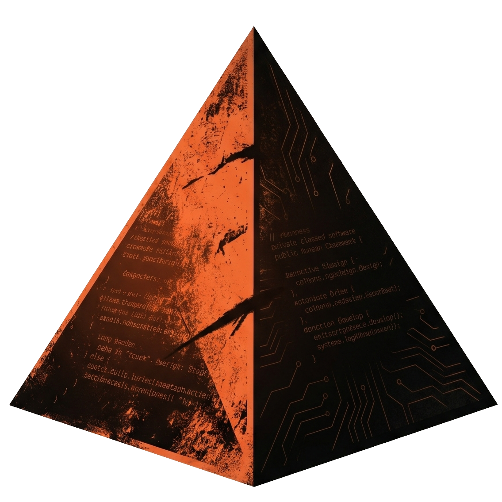

# otherness

_in memory of mankind_

<p align="center">
  
</p>

**You seed the vision. The system builds the product.**

otherness is a perpetual autonomous development system. You describe what you want the
product to become. The system implements it, reviews it, ships it, and raises the bar on
itself — continuously, on a schedule, without you in the loop between cycles.

One human. Multiple products. Each advancing on its own.

---

## How it works

Every project using otherness runs two steps every hour on GitHub Actions:

```
Step A — Vision scan
  Reads the project's vision pressure context.
  Finds gaps against the bar you set.
  Writes new design doc items for the next queue.

Step B — SDLC loop
  Coordinator claims the highest-priority design-backed item.
  Engineer implements it in an isolated branch.
  QA waits for all CI checks to pass, reviews, merges.
  SM posts health signal. Session branch lands on main.
```

You do not trigger this. You do not approve the PRs. You read the health signals and
redirect when needed.

---

## The D4 model

Every feature follows the same hierarchy. No exceptions.

```
vision.md           you write this once — the bar the product must reach
    ↓
roadmap.md          stages of delivery
    ↓
docs/design/        how each area works — written before implementation
    ↓
spec.md             one item, one PR — references its design doc
    ↓
code                the implementation, nothing more
    ↓
design doc update   🔲 Future → ✅ Present, in the same PR
```

QA blocks any PR whose spec does not reference a design doc. COORD reads `🔲 Future`
items as its primary work queue. The PM flags any roadmap stage with no design doc coverage.

Every line of code traces to a design decision that existed before it was written.

---

## The perpetual vision loop

The vision does not require a human to keep showing up. Between your sessions, otherness
synthesises direction autonomously:

1. **Step A** reads the vision pressure context (injected in the workflow prompt) and
   identifies gaps — missing features, quality shortfalls, adoption blockers — against
   the bar you set.
2. Those gaps become `🔲 Future` items in design docs.
3. COORD queues them. ENG implements them.
4. When ~60% of the named gaps are addressed, the agent rewrites the pressure context
   to raise the bar automatically (design doc 37 — SCAN 5).

The product keeps improving even when you are not thinking about it. When you return to
run a vision session, the system will have already closed the obvious gaps and moved to
harder ones.

---

## Your interaction model

In the steady state, your role is:

| Activity | Frequency | Time |
|---|---|---|
| Read the batch health signals | Weekly | 5 min |
| Run `/otherness.vibe-vision` for new direction | When you have intent | 30-60 min |
| Unblock `[NEEDS HUMAN]` escalations | Rare | Minutes |
| Run `/otherness.status --fleet` for fleet health | Weekly | 5 min |

That's it. No PR reviews. No sprint planning. No release ceremonies.

See **[docs/steering.md](./docs/steering.md)** for the full monitoring and steering guide.

---

## Quick start

### Prerequisites (once per machine)

```bash
npm install -g @opencode-ai/cli    # OpenCode — the AI agent runtime
brew install gh && gh auth login   # GitHub CLI
git clone git@github.com:<your-username>/otherness.git ~/.otherness
```

### New project

```bash
cd your-project
/otherness.setup            # creates otherness-config.yaml, deploys commands
/otherness.vibe-vision      # seed the initial vision through dialogue
/otherness.run              # first local session — generates queue, starts working
```

After the first local session, the scheduled workflow takes over. You do not need to
run `/otherness.run` again unless you want to trigger a manual session.

### Existing project

```bash
cd your-project
/otherness.setup
/otherness.onboard          # reads codebase, generates docs/aide/ drafts, seeds state
# Review and merge the generated PR, then:
/otherness.vibe-vision      # align the generated vision with your intent
```

See **[onboarding-new-project.md](./onboarding-new-project.md)** and
**[onboarding-existing-project.md](./onboarding-existing-project.md)** for full walkthroughs.

---

## Commands

### Your regular loop

| Command | Purpose |
|---|---|
| `/otherness.vibe-vision` | Co-author vision through dialogue — the only way to seed new direction |
| `/otherness.status [--fleet]` | Health summary for this project or all monitored projects |
| `/otherness.run` | Manual session — same as scheduled, but you trigger it |

### Setup (once or rarely)

| Command | Purpose |
|---|---|
| `/otherness.setup` | One-time init — creates config, deploys commands, creates D4 stubs |
| `/otherness.onboard` | Existing project — reads codebase, generates `docs/aide/` drafts |
| `/otherness.upgrade` | Manage agent version pinning |

### Advanced

| Command | Purpose |
|---|---|
| `/otherness.run.bounded` | Scoped agent with declared boundaries — run multiple concurrently |
| `/otherness.arch-audit` | Adversarial audit — docs vs source, structural analysis |
| `/otherness.learn [repo ...]` | Study open-source repos, internalize patterns into agent skills |

---

## Scheduled execution

The workflow that runs on GitHub Actions is in `.github/workflows/otherness-scheduled.yml`.
It is deployed by `/otherness.setup` and `/otherness.onboard` automatically.

**Authentication options:**

| Option | Security | Setup |
|---|---|---|
| GitHub App (recommended) | Per-repo token, 1-hour lifetime, not exportable | Create App, add `APP_ID` + `APP_PRIVATE_KEY` secrets |
| Personal Access Token | All-repo access, long-lived | Add `GH_TOKEN` secret with `repo+workflow` scopes |

See **[docs/security.md](./docs/security.md)** for the full security model, threat analysis,
and hardening checklist.

See **[docs/perpetual-execution.md](./docs/perpetual-execution.md)** for how the scheduled
execution model works, the session lifecycle, and concurrency behavior.

---

## Self-improvement

otherness runs on itself. Every improvement to its agent logic deploys to every project
using otherness on their next session startup via `git -C ~/.otherness pull`.

The skills library (`agents/skills/`) grows via `/otherness.learn`. Design docs 35-38
describe the self-improvement mechanisms: vision alignment signals, pressure prompts that
raise their own bar, CI gates that never bypass failing checks.

---

## How it fits together

```
Your project
  otherness-config.yaml         ← the only file you edit regularly
  AGENTS.md                     ← project identity, read by agents at startup
  .otherness/state.json         ← team state (on _state branch, never on main)
  docs/aide/
    vision.md                   ← what you're building (human-authored, agent-read)
    roadmap.md                  ← delivery stages
    definition-of-done.md       ← acceptance journeys
    progress.md                 ← current state (agent-updated each batch)
  docs/design/
    NN-area.md                  ← design doc per feature area (🔲 Future → ✅ Present)
  .opencode/command/
    otherness.run.md            ← /otherness.run
    otherness.vibe-vision.md    ← /otherness.vibe-vision
    otherness.status.md         ← /otherness.status
    (and others)
  .github/workflows/
    otherness-scheduled.yml       ← hourly cron: Step A (vision) + Step B (run)
    otherness-security-checks.yml ← AGENTS.md change detection on every PR

~/.otherness/                   ← shared install, auto-updated on every session startup
  agents/standalone.md          ← full autonomous team logic
  agents/vibe-vision.md         ← vision authoring agent (interactive)
  agents/vibe-vision-auto.md    ← autonomous vision scan (Step A, scheduled)
  agents/phases/                ← coord, eng, qa, sm, pm phases
  agents/skills/                ← reusable patterns, grown by /otherness.learn
```

---

## Observability

| What you want | Where |
|---|---|
| What's being worked on | Open issues labeled with your project label |
| Queue | GitHub issues (open, labeled `otherness`) |
| Batch reports | Report issue (see `REPORT_ISSUE` in `AGENTS.md`) |
| Blocking decisions | Issues labeled `needs-human` |
| CI status | GitHub Actions → main branch runs |
| Fleet health | `/otherness.status --fleet` or SM cross-project report |

---

## Dependencies

**[OpenCode](https://opencode.ai)** — AI coding agent runtime. Discovers and runs `.opencode/command/*.md` slash commands. Required.

```bash
npm install -g @opencode-ai/cli
```

**[gh CLI](https://cli.github.com)** — all GitHub interaction. Required.

```bash
brew install gh && gh auth login
```

**[git](https://git-scm.com)** — VCS, worktree isolation, self-update mechanism. Required.

**[python3](https://python.org)** — config parsing, state read/write. Standard library only. 3.8+. Required.

---

## Further reading

- **[docs/perpetual-execution.md](./docs/perpetual-execution.md)** — scheduled execution model, session lifecycle, concurrency
- **[docs/security.md](./docs/security.md)** — security model, token options, hardening checklist
- **[docs/steering.md](./docs/steering.md)** — how to monitor and direct a running system
- **[onboarding-new-project.md](./onboarding-new-project.md)** — full walkthrough for new projects
- **[onboarding-existing-project.md](./onboarding-existing-project.md)** — adopting otherness into an existing codebase
- **[docs/design/27-security-model.md](./docs/design/27-security-model.md)** — full threat model and mitigation analysis
- **[docs/design/28-dual-step-scheduled-workflow.md](./docs/design/28-dual-step-scheduled-workflow.md)** — design doc for the dual-step execution model
- **[docs/design/37-self-updating-pressure-prompts.md](./docs/design/37-self-updating-pressure-prompts.md)** — how the vision bar raises itself
